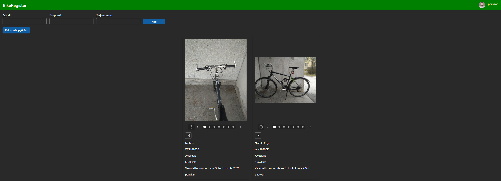
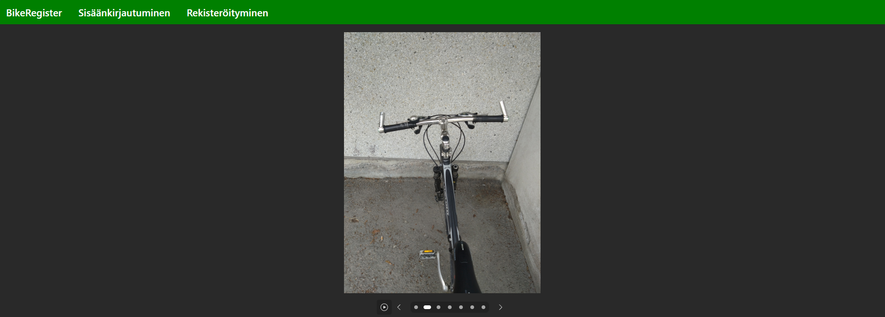
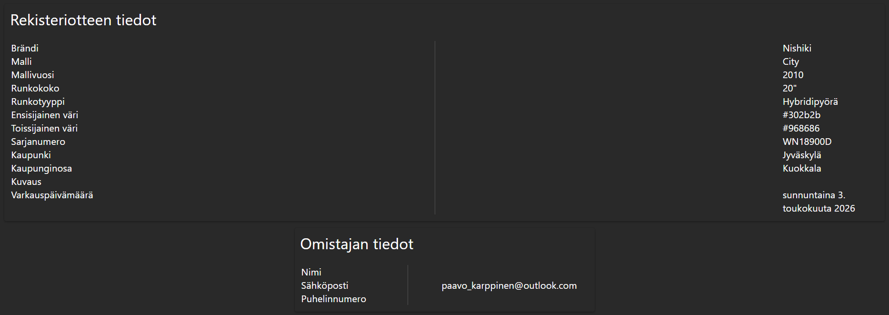
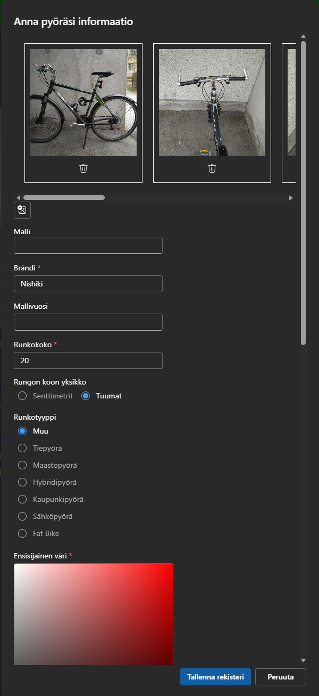
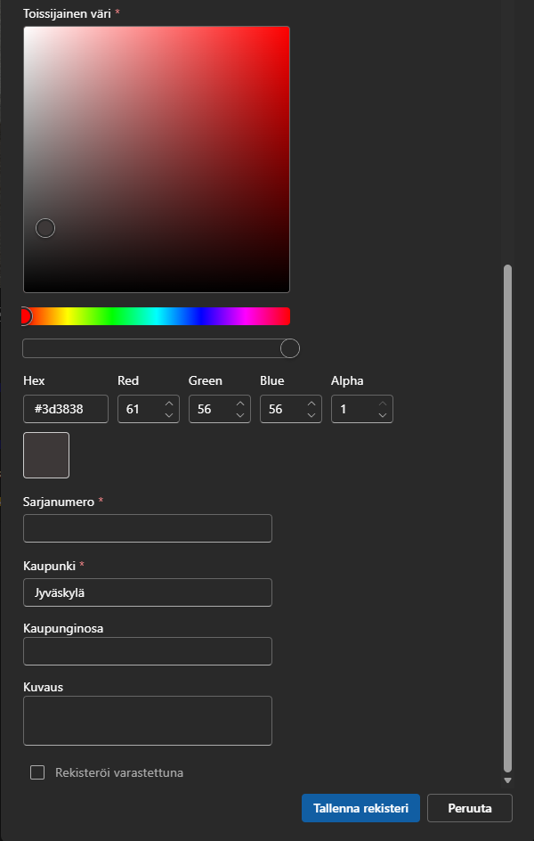
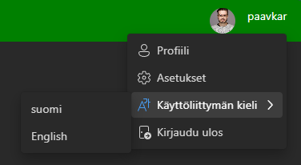
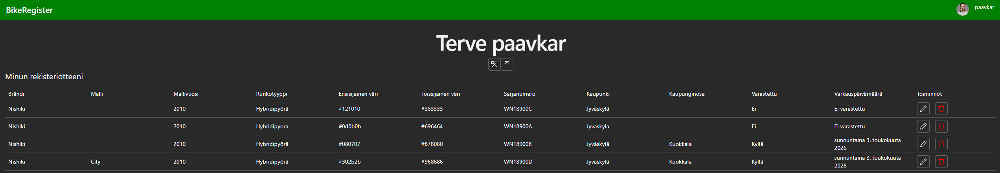

# BikeRegister

## Technologies

The API for this project was started with my [.NET Web API template](https://github.com/paavkar/CleanArchitectureIdentityTemplate). As such, it follows Clean Architecture and was started with
ASP.NET Core Identity support. This template uses [.NET 10](https://dotnet.microsoft.com/en-us/download/dotnet/10.0) and SQL Server.

Datbase operations on the backend use [Entity Framework Core](https://learn.microsoft.com/en-us/ef/core/). Images are saved on [Azure Blob Storage](https://azure.microsoft.com/en-us/products/storage/blobs) (locally using [Azurite](https://learn.microsoft.com/en-us/azure/storage/common/storage-use-azurite)).

UI technologies:

- [React](https://react.dev/),
- [Bun](https://bun.sh/) with [Vite](https://vite.dev/)
- [Hey API](https://heyapi.dev/),
- [i18next](https://react.i18next.com/),
- [Fluent UI](https://storybooks.fluentui.dev/react/?path=/docs/concepts-introduction--docs)
- [TanStack Form](https://tanstack.com/form/latest) with [Zod](https://zod.dev/),
- [TanStack Query](https://tanstack.com/query/latest),
- [TanStack Router](https://tanstack.com/router/latest),
- [Zustand](https://zustand.site/en/).

## Introduction

This application was borne from a desire to build an actually useful service after watching
a YouTube video on a similar service being used elsewhere. The goal of this application is
to give people the opportunity to report their bike as stolen and for others to see stolen
bikes. This software was created with the Finnish market in mind.

Any user can view the bikes reported as stolen. They can filter the results based on the city,
serial number (identifier from bike's frame), and brand. This filtering works so that
users can see certain brands in certain city if they wanted that.

Registered users can register their bike, and also see their own registrations on their
profile page. While creating a registration, user can add up to 10 images. Required information
about the bike are the brand, frame size, the type of frame, colours (primary and secondary),
and city. User can optionally register their bike as stolen, in which case, they choose the
date it was stolen. Optional information user can give include: model, model year, city district, and description. When registering their bike, the serial number has to be unique.

When he bike has been registered, the registering user can report it as stolen or not either
in their profile page or the detail page. When reporting as stolen in this manner, the stolen
date will be set as the date of the action.

UI responsiveness has been taken into account as much as possible. This means that the UI
responds to the screen size, meaning that the UI is slightly different from desktop (or tablet)
and phone usage.

## UI Screenshots

The following screenshots show the current state of the application. While the screenshots have text in Finnish, localization includes English as well.

### Home page

### Registration detail page

This page shows more detailed information about the registration. As can be seen from the screenshots any user of the application can view the information on stolen bikes. A non-logged in user cannot view registrations that have not been reported as stolen. This view also shows
the owner information so that users can contact the owner in case they wanted to.

### Add window (modal)

These two screenshots show the dialog that opens when user wants to register their bike.
The colour picker component from Fluent UI allows user to pick their colour. The colour
saved on the database will be the hex code.

### Menu

This menu allows (currently) the signed in user to change the UI language, go to their profile,
or log out from the application. It is opened from the profile photo persona and user name text.

### Profile page

Profile page currently shows the user's registrations in a table where they can report the
bike as either stolen or not.
